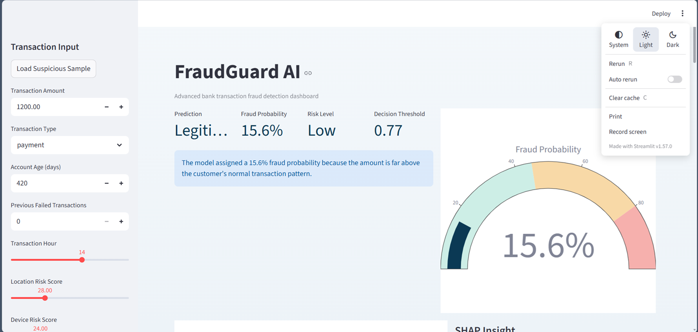
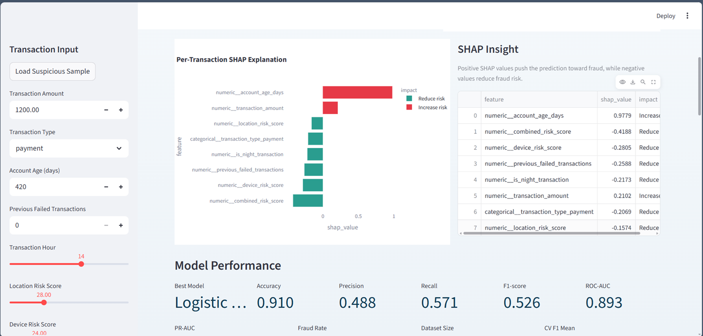
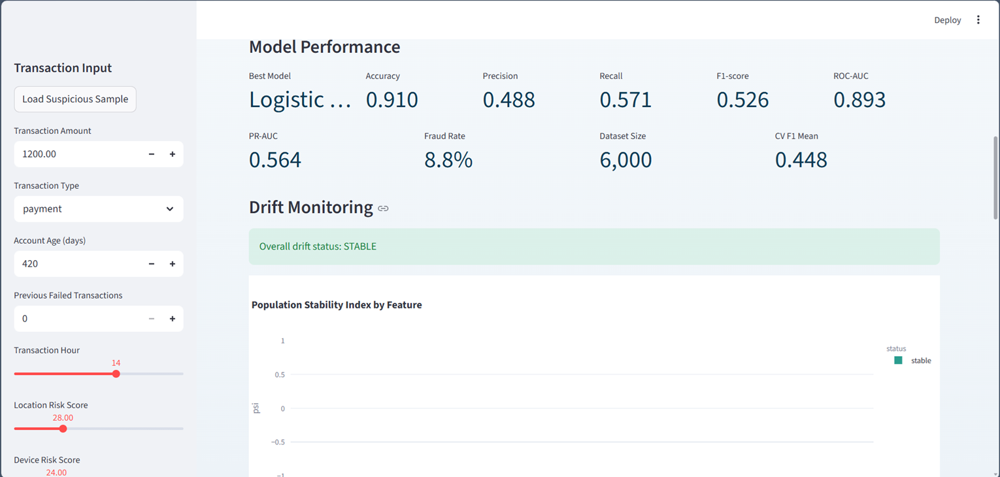
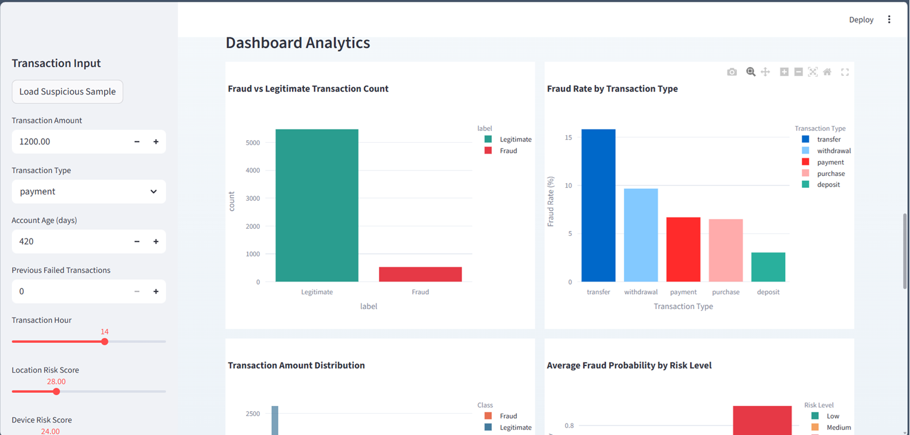
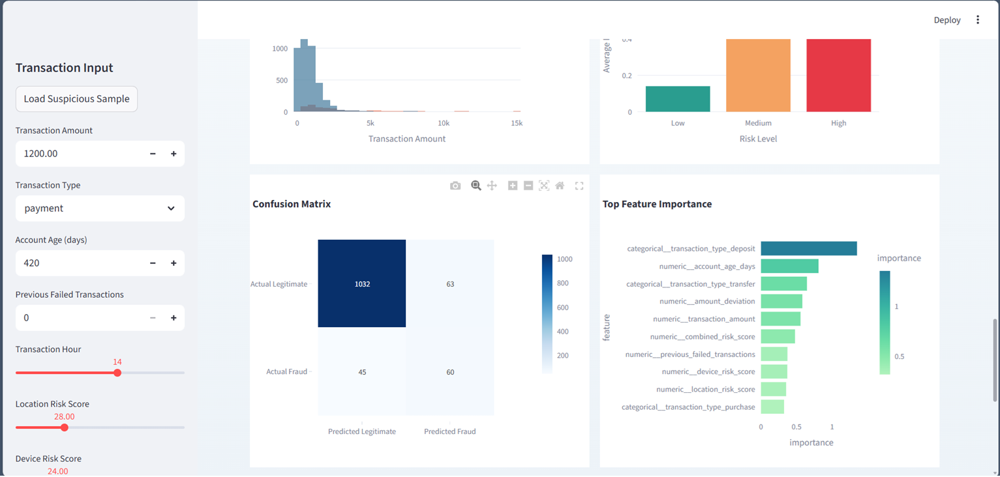
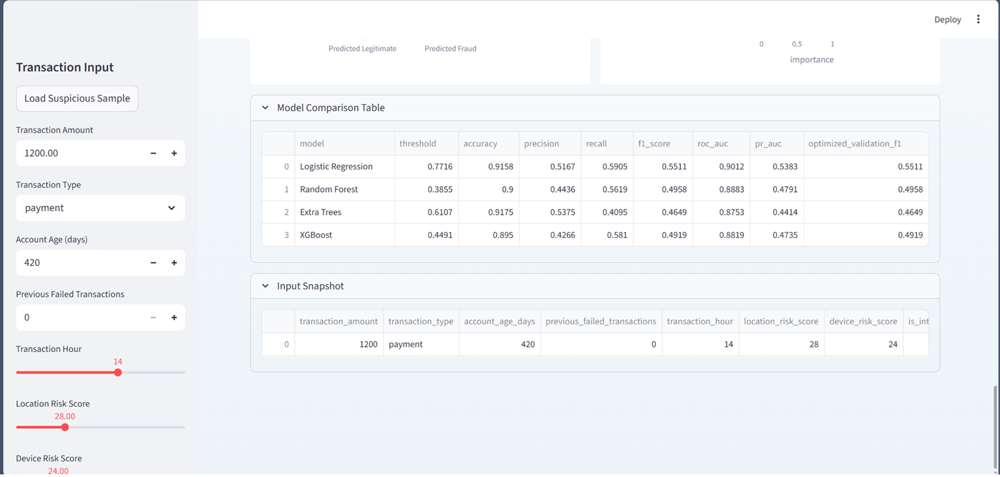

# FraudGuard AI - Bank Transaction Fraud Detection System

FraudGuard AI is an end-to-end machine learning project for detecting potentially fraudulent bank transactions. It combines synthetic transaction data generation, feature engineering, model training, threshold tuning, SHAP-based explainability, drift monitoring, a Streamlit dashboard, and a FastAPI inference service.

## Problem Statement

Banks need to identify suspicious transactions quickly without overwhelming fraud analysts with false alarms. This project simulates that workflow by scoring transactions using customer behavior, transaction context, risk signals, and account activity patterns, then surfacing predictions with interpretable explanations.

## Features

- Generates a realistic synthetic banking dataset with 6,000 transactions
- Engineers advanced fraud signals such as amount deviation, transaction-to-average ratio, and combined risk interactions
- Trains and compares Logistic Regression, Random Forest, Extra Trees, and XGBoost
- Tunes the fraud decision threshold on a validation split instead of relying on a fixed `0.5`
- Evaluates models using accuracy, precision, recall, F1-score, ROC-AUC, PR-AUC, confusion matrix, and cross-validation
- Saves the best model bundle, metrics, feature importance, drift baseline, and drift report
- Provides SHAP explanations for per-transaction interpretability
- Includes a Streamlit dashboard for live prediction, model analytics, SHAP explanations, and drift visibility
- Exposes a FastAPI service for programmatic fraud predictions and drift evaluation
- Includes Docker support and GitHub Actions CI

## Tech Stack

- Python
- Pandas
- NumPy
- Scikit-learn
- XGBoost
- SHAP
- Streamlit
- FastAPI
- Plotly
- Joblib
- Docker
- GitHub Actions

## Project Structure

```text
fraudguard-ai/
│
├── api/
│   ├── __init__.py
│   └── main.py
├── data/
│   └── transactions.csv
├── model/
│   ├── drift_baseline.json
│   ├── drift_report.json
│   ├── feature_importance.csv
│   ├── fraud_model.pkl
│   └── model_metrics.json
├── notebooks/
│   └── exploration.ipynb
├── screenshots/
├── .github/
│   └── workflows/
│       └── ci.yml
├── app.py
├── drift_utils.py
├── explainability.py
├── fraud_utils.py
├── monitor_drift.py
├── train_model.py
├── Dockerfile
├── docker-compose.yml
├── requirements.txt
└── README.md
```

## ML Workflow

1. Generate or load a transaction dataset.
2. Engineer higher-signal fraud features from the raw transaction fields.
3. Split the data into train, validation, and test sets.
4. Preprocess categorical variables using `OneHotEncoder` and numeric variables using `StandardScaler`.
5. Train and compare multiple classification models.
6. Tune the prediction threshold on the validation set using F1-score.
7. Refit the best model on the combined training and validation data.
8. Save the trained model bundle and evaluation artifacts.
9. Serve fraud predictions through Streamlit and FastAPI.
10. Monitor new data batches for drift using PSI-based thresholds.

## Dataset Schema

The dataset includes:

- `transaction_amount`
- `transaction_type`
- `account_age_days`
- `previous_failed_transactions`
- `transaction_hour`
- `location_risk_score`
- `device_risk_score`
- `is_international`
- `average_daily_transaction_amount`
- `fraud`

Fraud is made more likely when the amount is unusually high, the account is new, the transaction occurs late at night, the location and device are risky, the transaction is international, or failed attempts have already occurred.

## Local Setup

Install dependencies:

```bash
python -m pip install -r requirements.txt
```

Train the model and generate all artifacts:

```bash
python train_model.py
```

Run drift monitoring on a CSV batch:

```bash
python monitor_drift.py --input data/transactions.csv --output model/drift_report.json
```

Launch the Streamlit dashboard:

```bash
streamlit run app.py
```

Launch the FastAPI service:

```bash
uvicorn api.main:app --reload
```

## API Endpoints

- `GET /health` - Health check
- `GET /metrics` - Saved model metrics
- `GET /drift/latest` - Latest saved drift report
- `POST /predict` - Predict fraud for one transaction
- `POST /drift/evaluate` - Evaluate drift on a batch of transactions

### Example Prediction Request

```json
{
  "transaction_amount": 7800,
  "transaction_type": "transfer",
  "account_age_days": 18,
  "previous_failed_transactions": 4,
  "transaction_hour": 1,
  "location_risk_score": 89,
  "device_risk_score": 84,
  "is_international": 1,
  "average_daily_transaction_amount": 320
}
```

## Docker

Build and run both services:

```bash
docker compose up --build
```

This exposes:

- FastAPI at `http://localhost:8000`
- Streamlit at `http://localhost:8501`

## CI Pipeline

The GitHub Actions workflow:

- installs dependencies
- trains the model
- runs drift monitoring
- smoke-tests the FastAPI app
- smoke-tests the Streamlit app import

## Screenshots

### 1. Dashboard Overview



Shows the transaction input sidebar, fraud prediction summary, fraud probability gauge, and explanation panel.

### 2. SHAP Explanation View



Highlights per-transaction SHAP contributions and the top features influencing the fraud decision.

### 3. Model Performance and Drift Monitoring



Displays core evaluation metrics and PSI-based drift monitoring with overall system status.

### 4. Dashboard Analytics Overview



Shows fraud count comparison and fraud rate by transaction type.

### 5. Additional Analytics



Includes transaction amount distribution, average fraud probability by risk level, confusion matrix, and top feature importance.

### 6. Model Comparison Table



Compares Logistic Regression, Random Forest, Extra Trees, and XGBoost across threshold, accuracy, precision, recall, F1-score, ROC-AUC, and PR-AUC.

## Future Improvements

- Replace synthetic data with real banking event streams
- Add authenticated analyst workflows
- Persist prediction logs in a database
- Add scheduled drift jobs and alert notifications
- Deploy the API and dashboard to cloud infrastructure

## CV Bullet Points

- Built an end-to-end fraud detection system using Python, Scikit-learn, XGBoost, SHAP, Streamlit, and FastAPI.
- Designed a full ML workflow covering data generation, feature engineering, model comparison, threshold tuning, evaluation, deployment, and monitoring.
- Implemented per-transaction SHAP explanations and PSI-based drift monitoring for production-style interpretability and data quality checks.
- Containerized the project with Docker and added GitHub Actions CI for reproducible training and verification.

## GitHub Push Guide

```bash
git init
git add .
git commit -m "Build advanced FraudGuard AI fraud detection system"
git branch -M main
git remote add origin https://github.com/YOUR_USERNAME/fraudguard-ai.git
git push -u origin main
```
